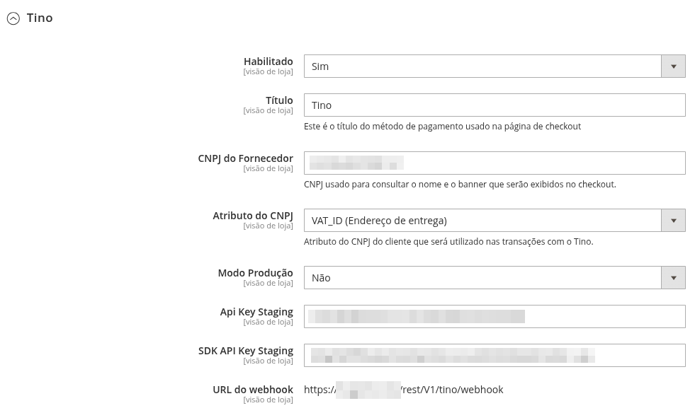
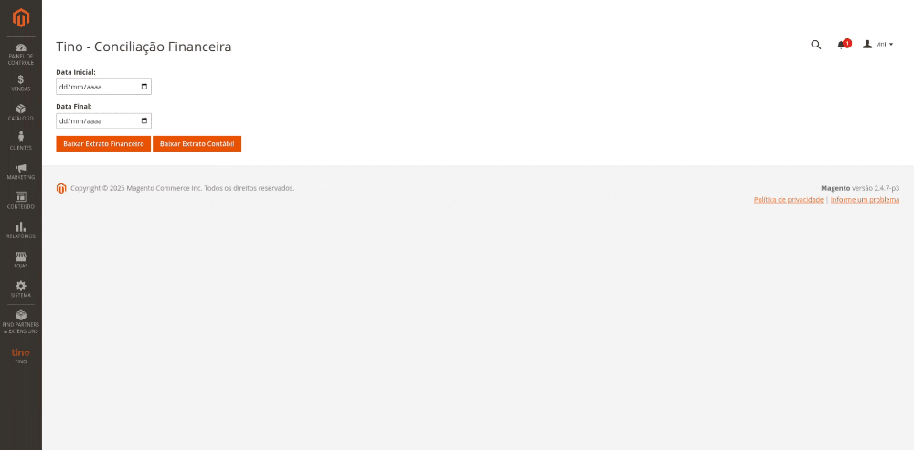

# Módulo de Pagamento Tino para Magento 2

O **Módulo Tino_Payment** permite a integração do pagamento Tino com lojas Magento 2. Ele foi desenvolvido para oferecer uma solução de pagamento segura e eficiente, garantindo conformidade com as diretrizes do Magento.

## Compatibilidade
- **Magento 2**: 2.4.5+
- **PHP**: 8.2 e 8.3

## Instalação do Módulo

### Via `app/code`
1. Copie a pasta `Tino` para `app/code/`
2. Execute os seguintes comandos:
   ```bash
   bin/magento module:enable Tino_Payment
   bin/magento setup:upgrade
   bin/magento cache:flush
   ```

### Via Composer
1. Execute o seguinte comando:
   ```bash
   composer require tino/payment
   ```
2. Depois, habilite o módulo e limpe o cache:
   ```bash
   bin/magento module:enable Tino_Payment
   bin/magento setup:upgrade
   bin/magento cache:flush
   ```

## Configuração do Módulo
Para configurar o módulo, acesse o painel administrativo do Magento e siga o caminho:
```
Lojas → Configuração → Vendas → Forma de Pagamento → Tino
```

### Opções de Configuração



| Campo                  | Descrição |
|------------------------|------------|
| **Habilitado**         | Ativa ou desativa o pagamento Tino. |
| **CNPJ do Fornecedor** | CNPJ para exibir nome e banner no checkout. |
| **Atributo do CNPJ**   | Define qual campo do cliente será usado para o CNPJ. |
| **Modo Produção**     | Define se o ambiente de produção será usado. |
| **API Key Staging**    | Chave API para ambiente de testes. |
| **SDK API Key Staging** | Chave SDK para ambiente de testes. |
| **API Key Produção**   | Chave API para ambiente de produção. |
| **SDK API Key Produção** | Chave SDK para produção. |
| **Webhook URL**        | URL do webhook do Magento para integração com o Tino. |

## Exibição no frontend

Após a correta configuração do módulo, o método de pagamento Tino estará disponível no checkout do Magento.

O layout segue o padrão do Magento e pode ser customizado conforme necessidade. Para ilustrar, veja abaixo um exemplo de como o método Tino aparecerá para o usuário:


## Envio da Nota Fiscal
O módulo requer o envio da nota fiscal para capturar pagamentos. O ERP pode enviar a NF pelo endpoint:

```http
POST https://{dominio-da-loja}/rest/V1/tino/nota-fiscal
```

### Exemplo de Requisição
```json
{
  "incrementId": "0000001",
  "nfes": [
    {
      "amount_cents": 1000,
      "nf_data": "<XML_BASE64>",
      "nf_external_id": "ID_UNICO",
      "notes": "Observações",
      "items": [
        { "item_id": 1, "qty": 1 }
      ]
    }
  ],
  "lastBatch": true
}
```
### Campos da Nota Fiscal

| Campo                  | Descrição                                                       |
|------------------------|-----------------------------------------------------------------|
| **incrementId**        | Identificador do pedido no Magento. (increment_id)              |
| **amount_cents**       | Valor da nota fiscal em centavos. (valor multiplicado por 100). |
| **nf_data**            | XML da nota fiscal em Base64.                                   |
| **nf_external_id**     | Código único da nota fiscal.                                    |
| **notes**              | Observações sobre a nota fiscal.                                |
| **items**              | Lista dos itens faturados.                                      |
| **items → item_id**    | Identificador do item no pedido.                                |
| **items → qty**        | Quantidade faturada do item.                                    |
| **lastBatch**          | Indica se essa é a última nota do pedido.                       |


## Acessando a Conciliação Financeira
O painel administrativo do Magento possui uma página específica para baixar relatórios financeiros:
```
Tino → Conciliação Financeira
```

- O administrador pode baixar:
    - **Extrato financeiro** (CSV)
    - **Extrato contábil** (CSV)



Acesso restrito às permissões de usuários no Magento.

---


